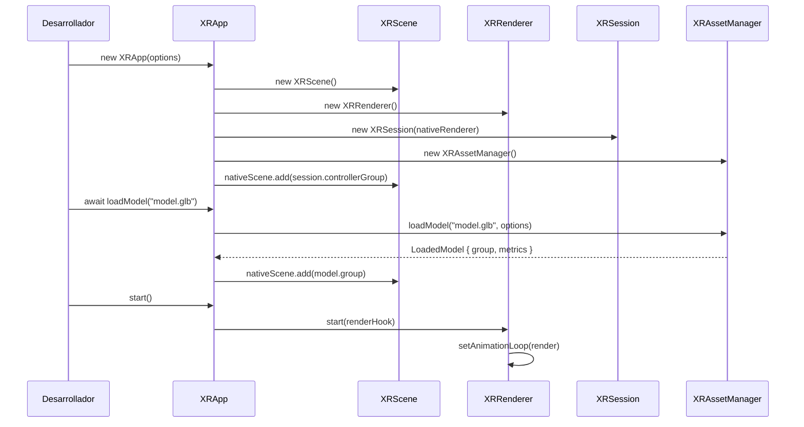

# Módulo Educativo: XRApp

> Guía de aprendizaje profundo sobre la fachada central de VXR.

---

## 1. Qué problema resuelve
En Three.js y WebXR puros, para iniciar una experiencia 3D interactiva es necesario conectar manualmente al menos 5 piezas:
1. Un contenedor HTML en el DOM.
2. Una escena `THREE.Scene`.
3. Una cámara `THREE.PerspectiveCamera`.
4. Un renderizador `THREE.WebGLRenderer` con `xr.enabled = true`.
5. Un cargador `GLTFLoader` con decodificador DRACO.
6. Controles de órbita `OrbitControls`.
7. Un botón WebXR que negocie sesiones inmersivas.
8. Un bucle de animación `setAnimationLoop`.

Esto produce entre 70 y 120 líneas de código repetitivo (*boilerplate*) en cada proyecto antes de poder ver el primer modelo 3D. `XRApp` resuelve esto unificando todo en una **Fachada (*Facade Pattern*)** ergonómica.

---

## 2. Qué hace
- Instancia y conecta internamente `XRScene`, `XRRenderer`, `XRSession` y `XRAssetManager`.
- Proporciona el método `loadModel(url)` que descarga, centra, apoya en el suelo y calcula métricas del modelo.
- Activa `OrbitControls` para navegación con ratón en PC y los desactiva automáticamente cuando el usuario entra a VR para evitar conflictos.
- Conecta los mandos WebXR con rayos láser visibles para que la interacción funcione de inmediato en Meta Quest.
- Expone métodos de raycast unificados (`raycastPointer` y `raycastController`).

---

## 3. Cómo funciona internamente


---

## 4. Qué parte corresponde a Three.js
- `THREE.PerspectiveCamera`: La cámara física que proyecta la perspectiva.
- `THREE.Scene`: El grafo de nodos que contiene los objetos 3D.
- `THREE.WebGLRenderer`: El contexto gráfico que dibuja en el canvas.
- `OrbitControls`: La librería que traduce los movimientos del ratón en rotación de cámara.

---

## 5. Qué parte corresponde a WebXR
- La activación de `renderer.xr.enabled = true`.
- La desactivación de `OrbitControls` durante sesiones activas (`session.onStateChange`).
- La lectura de mandos 6DoF y el raycasting desde la orientación del visor.

---

## 6. Cómo se haría sin VXR (Three.js puro)
```javascript
// Sin VXR: ~80 líneas requeridas
const container = document.getElementById('app');
const scene = new THREE.Scene();
const camera = new THREE.PerspectiveCamera(60, window.innerWidth / window.innerHeight, 0.1, 100);
camera.position.set(0, 1.6, 3);

const renderer = new THREE.WebGLRenderer({ antialias: true });
renderer.setSize(window.innerWidth, window.innerHeight);
renderer.xr.enabled = true;
container.appendChild(renderer.domElement);

const controls = new OrbitControls(camera, renderer.domElement);
const ambient = new THREE.AmbientLight(0xffffff, 0.7);
const sun = new THREE.DirectionalLight(0xfffaed, 1.2);
scene.add(ambient, sun);

const loader = new GLTFLoader();
loader.load('./model.glb', (gltf) => {
  const box = new THREE.Box3().setFromObject(gltf.scene);
  gltf.scene.position.y = -box.min.y; // grounding manual
  scene.add(gltf.scene);
});

renderer.setAnimationLoop(() => {
  controls.update();
  renderer.render(scene, camera);
});

document.body.appendChild(VRButton.createButton(renderer));
```

---

## 7. Cómo VXR lo simplifica
```typescript
import { XRApp } from '@vxr/core';

const app = new XRApp();
await app.loadModel('./model.glb');
app.start();
```

---

## 8. Errores comunes
1. **Llamar a `start()` antes de configurar listeners o escenas**: Aunque funciona, es mejor práctica registrar hooks `onUpdate` antes de arrancar el bucle.
2. **Intentar instanciar `XRApp` en Node.js (SSR)**: `XRApp` depende de `window`, `document` y WebGL; debe ejecutarse exclusivamente en el cliente (*Client-Side Only*).
3. **Olvidar desuscribirse de `onUpdate`**: El método devuelve una función de limpieza `const unsubscribe = app.onUpdate(...)` que debe invocarse al desmontar la vista.

---

## 9. Qué deberías estudiar para comprenderlo mejor
- **Patrón de diseño Fachada (*Facade Pattern*)**: Comprender cómo una clase puede simplificar el acceso a un subsistema complejo sin eliminar el acceso a los objetos internos.
- **Inversión de dependencias y composición**: Por qué `XRApp` contiene instancias de `XRScene` y `XRRenderer` en lugar de heredar de ellas.

---

## 10. Lo que aprendí y Preguntas pendientes

### Lo que aprendí:
- Una buena fachada no oculta las capacidades de las herramientas subyacentes; proporciona atajos ergonómicos para el 90% de los casos comunes y expone accesos directos (`nativeScene`, `nativeRenderer`) para el 10% de casos avanzados.

### Preguntas pendientes:
- *¿Debería `XRApp` permitir inyectar una cámara o escena ya existente en lugar de crearlas siempre en el constructor?* (Candidato para v0.2: `options.scene`, `options.camera`).
